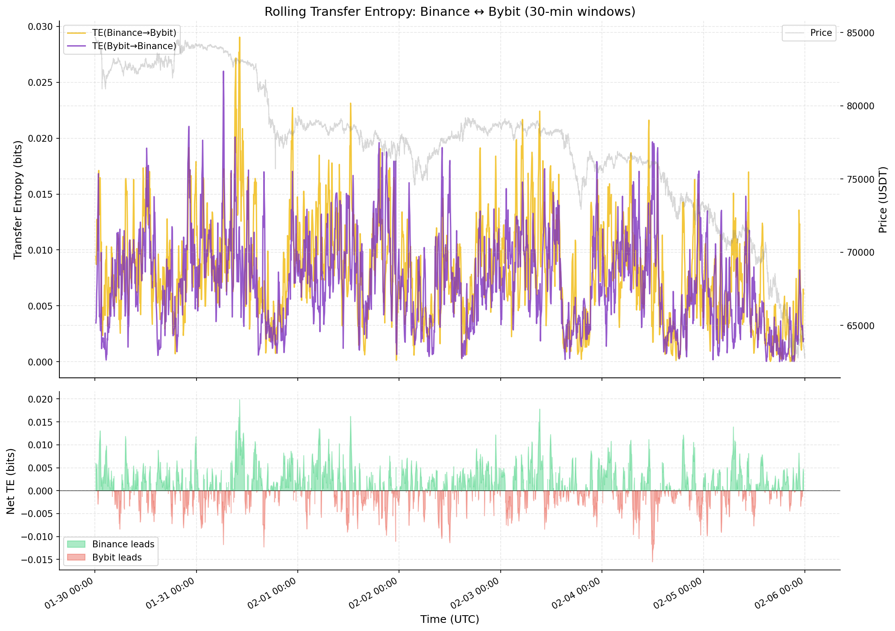
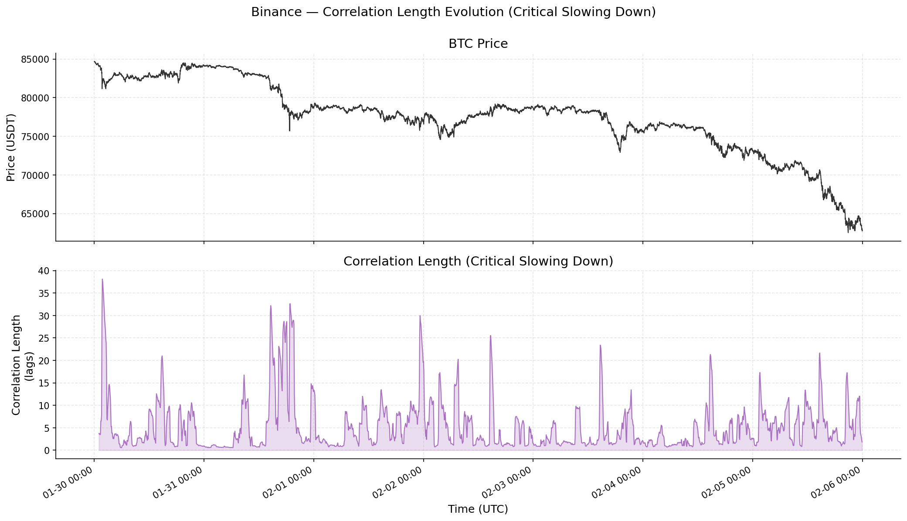
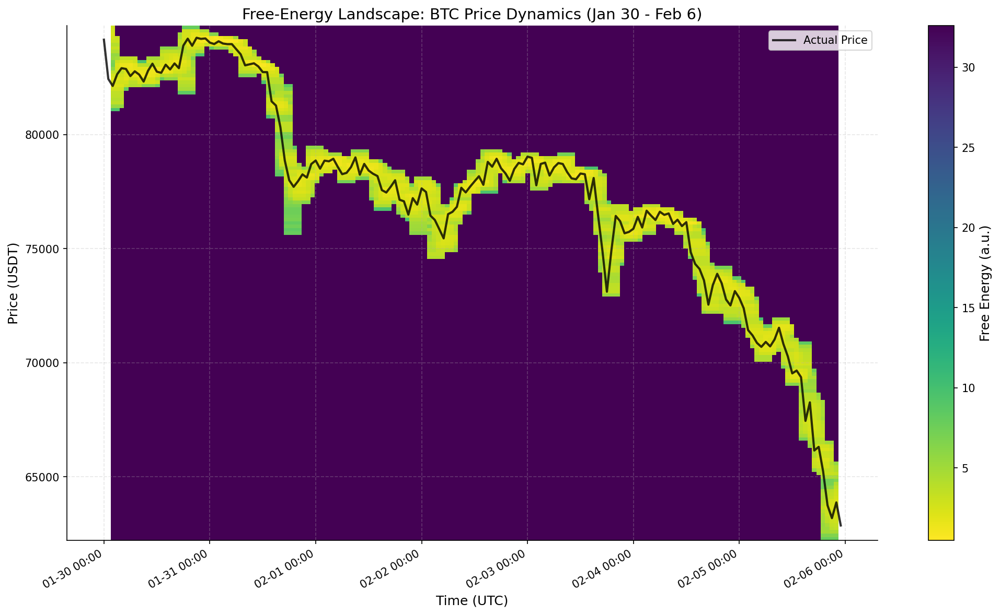
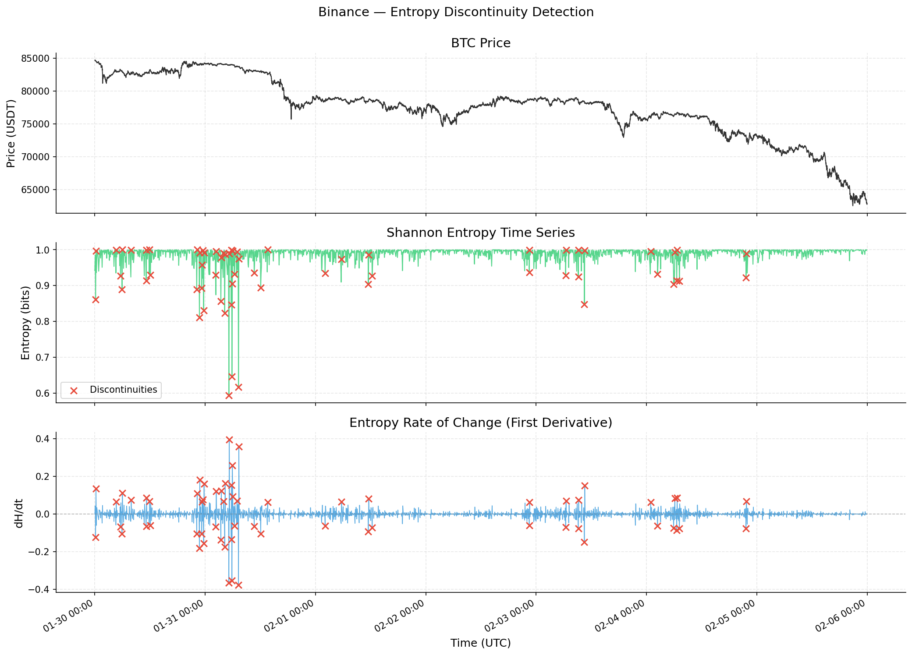
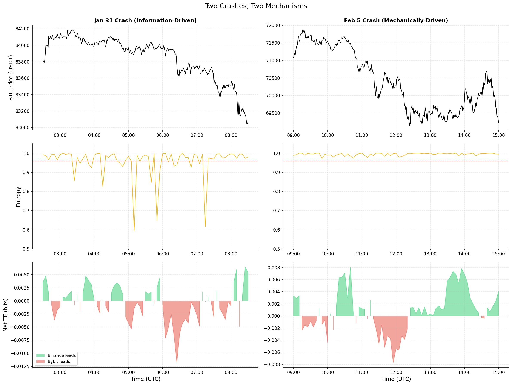

# Statistical Mechanics of Cross-Venue Information Flow in Bitcoin Perpetual Futures

## Abstract

This study applies statistical mechanics to quantify cross-venue information flow in Bitcoin perpetual futures during a major crash period (Jan 30 to Feb 6, 2026, 84K to 62K) across Binance and Bybit. Using Shannon entropy, transfer entropy, phase transition detection, and free-energy landscape construction, we identify three operationally distinct market states and demonstrate that two crashes within the same week exhibit fundamentally different microstructural signatures. The integrated autocorrelation time ($\tau_{\mathrm{int}}$) provides a genuine forward-looking signal ($\rho = 0.34$ with 30-minute forward volatility), Shannon entropy below the 5th percentile precedes significant price moves 88.1% of the time, and physics-based metastable levels overlap 90% with traditional support/resistance while adding quantitative strength measures. The central finding is that information-driven crashes (low entropy, clear venue leadership) and mechanically-driven crashes (normal entropy, liquidation cascades) require fundamentally different trading responses, and the statistical mechanics framework distinguishes them in real time.

## 1. Motivation

Cross-venue price discovery in crypto perpetual futures markets is poorly understood at the microstructure level. With BTC perpetual futures trading simultaneously on Binance, Bybit, OKX, and other venues, information does not originate uniformly: some venues lead, some follow, and the leadership hierarchy shifts dynamically. For a cross-venue HFT desk, three questions are critical: (1) where does informed trading originate, (2) when does the market undergo regime shifts, and (3) what are the quasi-stable price levels where the market lingers before transitioning?

Traditional approaches to these questions use linear correlation, simple volatility thresholds, and heuristic support/resistance (round numbers, swing points). This project tests whether statistical mechanics provides a more principled framework. We map market observables to thermodynamic quantities: trade sign entropy measures disorder, transfer entropy measures directional information flow, realised volatility serves as temperature, and the empirical price distribution defines a free-energy landscape with metastable states. The question is not whether markets are literally physical systems (they are not), but whether the mathematical tools of statistical mechanics extract useful structure that traditional methods miss.

### Physics Analogies: A Non-Physicist's Guide

The statistical mechanics framework maps market observables onto physical quantities. The mapping is not literal (markets are not physical systems), but the mathematical tools built for physics extract structure that traditional financial metrics miss. Here is the intuition behind each concept.

**Entropy** measures disorder. Imagine shuffling a deck of cards: a perfectly alternating red-black sequence has low entropy (highly ordered), while a random shuffle has high entropy. In our context, entropy measures the disorder of the buy/sell trade sequence. When entropy is high (~1.0), buys and sells arrive in no particular pattern, meaning no single group is dominating the order flow. When entropy drops sharply, one side is trading with conviction: the sequence becomes ordered, like a run of consecutive red cards. That ordering is the fingerprint of informed directional trading.

**Transfer entropy** measures who is copying whom. Standard correlation tells you two things move together; transfer entropy tells you which one moves *first* in a statistically meaningful way. If knowing Binance's recent trades helps you predict Bybit's next trade (beyond what Bybit's own history tells you), information is flowing from Binance to Bybit. It is the difference between "these two venues are correlated" and "Binance is leading."

**Temperature** is realised volatility. In physics, temperature measures how energetically particles are bouncing around. Here, it measures how energetically price is moving. A "hot" market has large, frequent price changes; a "cold" market is quiet. The analogy is direct: just as heating a solid causes its atoms to vibrate more violently, increased volatility causes price to fluctuate more aggressively around any given level.

**Free-energy landscape** is perhaps the most useful analogy. Picture a ball rolling on a hilly surface. The valleys are where the ball naturally settles (stable price levels), and the hills between them are barriers the ball must overcome to move to the next valley. We construct this landscape empirically: prices the market visits frequently become valleys (low free energy), and prices the market avoids become hills (high free energy). A deep valley means the market keeps returning to that price; a shallow valley means it lingers only briefly before moving on. This is the physics version of support and resistance, but with a continuous, quantitative measure of *how strong* each level is.

**Metastable states** are the shallow valleys. A ball sitting in a shallow bowl is stable for now, but a small nudge will push it over the rim. A ball in a deep bowl needs a large push. Metastable price levels are the same: the market sits there temporarily, but the level will eventually break. The depth of the well tells you how much force (trading pressure) is needed to break through. Traditional support/resistance is binary (level exists or it does not); the free-energy framework gives you a scalar strength measure and lets you watch it degrade in real time.

**Phase transitions** are regime shifts. Water does not gradually become ice; it undergoes an abrupt transition at a specific temperature. Markets exhibit analogous behaviour: a quiet, mean-reverting regime can shift abruptly into a trending, volatile regime. The physics framework provides tools to detect when the system is *approaching* such a transition, not just that one has already occurred.

**Critical slowing down** ($\tau_{\mathrm{int}}$) is the early warning. When a physical system approaches a phase transition, it takes longer to return to equilibrium after a perturbation. Poke a glass of water and it settles quickly; poke water at 99°C and the fluctuations persist longer. The integrated autocorrelation time measures this: when $\tau_{\mathrm{int}}$ rises, the market's volatility structure is becoming self-reinforcing, and perturbations take longer to dissipate. Empirically, this precedes volatility spikes ($\rho = 0.34$), making it a genuine forward-looking warning signal.

**Kramers escape theory** predicts how long a ball stays in a valley before thermal fluctuations push it over the barrier. The prediction is exponential: double the barrier height, and the expected dwell time increases exponentially. We tested this against real dwell times at metastable price levels and found only a weak relationship ($\rho = 0.157$). The reason is intuitive: in physics, escape is driven by random thermal noise. In markets, escape is driven by liquidation cascades and informed order flow, which are far more violent than "thermal" fluctuations. The market does not gently wander out of a support level; it gets shoved.

**The punchline:** Each physics tool targets a specific trading question. Entropy tells you *who is trading with conviction*. Transfer entropy tells you *which venue knows first*. Temperature tells you *how volatile conditions are*. The free-energy landscape tells you *where price wants to sit and how strongly*. And critical slowing down tells you *when a regime shift is approaching*. None of these require the market to actually be a physical system; they just require that the mathematical machinery, built over a century of statistical physics, is good at detecting structure in noisy data. It is.

## 2. Data and Methodology

### Data

We analyse 7 days of BTC-USDT perpetual futures trade data (Jan 30 to Feb 6, 2026) from two venues:

- **Binance:** 69.4 million trades, mean arrival rate 115 trades/s
- **Bybit:** 35.0 million trades, mean arrival rate 58 trades/s

This period includes two major crashes: a $6K drop on Jan 31 (from $84K to $78K) and a $13K drop on Feb 5-6 (from $75K to $62K), providing a natural experiment in regime transitions.

### Analytical Framework

The analysis proceeds in four stages, each building on the previous:

1. **Microstructure exploration** (Phase 2): Trade arrival rates, size distributions, autocorrelation structure, and the Epps effect (cross-venue correlation vs timescale).

2. **Entropy analysis** (Phase 3): Shannon entropy of trade signs in rolling 5-minute windows quantifies order flow disorder. Transfer entropy at 1-second resolution measures directional information flow between venues. Mutual information as a function of lag quantifies the information-sharing timescale.

3. **Phase transition detection** (Phase 4): Realised volatility (temperature), order flow imbalance (order parameter), and susceptibility define a thermodynamic state space. The integrated autocorrelation time ($\tau_{\mathrm{int}} = 0.5 + \sum_{k=1}^{k^*} \mathrm{ACF}(k)$, truncated at the first negative ACF) measures critical slowing down. Entropy discontinuity detection identifies first-order-like regime transitions.

4. **Metastability analysis** (Phase 5): The free-energy landscape $F(x) = -k_BT \ln P(x)$ is constructed from empirical price distributions in rolling 4-hour windows. Local minima identify metastable levels with quantitative well depths. Dwell time analysis measures how long the market lingers at each level, and Kramers escape theory is tested against the data.

## 3. Key Findings

### 3.1 Cross-Venue Information Flow

Transfer entropy resolves an information leadership hierarchy invisible to linear cross-correlation, which showed no detectable lead-lag at 1-second resolution (Phase 2). At history length $k=1$, TE(Binance $\to$ Bybit) = 0.00674 bits exceeds TE(Bybit $\to$ Binance) = 0.00641 bits, with Binance leading in 59.4% of rolling 30-minute windows. Transfer entropy is statistically significant (vs shuffled baseline) in 53.2% of Binance-led windows.

An important caveat: at $k=2$ and $k=3$, the leadership reverses to Bybit. This suggests Binance has faster "first-mover" influence (its most recent action predicts Bybit's next), while Bybit's influence operates through longer-range temporal patterns. The $k=1$ result is more relevant for low-latency execution; $k=2$-$3$ may be relevant for longer-horizon strategies.

Mutual information peaks at lag = 0 seconds (0.076 bits) and drops 86% within 1 second, confirming that the cross-venue information-sharing timescale is sub-second. Any informational edge from observing one venue's flow must be acted upon within 1-2 seconds.

### 3.2 Regime Detection and Phase Transitions

The integrated autocorrelation time provides the strongest forward-looking signal in the study: $\rho = 0.34$ with 30-minute forward volatility. When $\tau_{\mathrm{int}}$ exceeds its 90th percentile, subsequent volatility is 1.65$\times$ the baseline. This is a genuine early warning: the market's volatility structure becomes self-reinforcing before the regime shift fully materialises.

Entropy discontinuity detection reveals 63 first-order-like transitions, heavily concentrated around the Jan 31 crash but largely absent during the Feb 5-6 crash. This asymmetry is the key to the "two crashes, two mechanisms" finding (Section 3.4).

Regime classification using a 2-of-3 scoring system (temperature, entropy, correlation length) assigns clear labels (Hot, Cold, or Critical) to only ~44% of windows; the remaining ~56% are classified as Transitional, reflecting the stringency of requiring two simultaneous extreme-quartile indicators and indicating that markets are far from the clean phase separation of equilibrium systems.

### 3.3 Metastable Price Levels

The free-energy landscape constructed from rolling 4-hour price distributions identifies 98 metastable levels across 162 windows, with well depths ranging from 0.8 (shallow, transient) to 7.5 (deep, persistent). These physics-based levels overlap 90% with traditional support/resistance (18 of 20 traditional levels matched within $\pm$1%).

The value-add over traditional S/R is threefold: (1) quantitative strength via well depth, distinguishing strong support (depth > 5.0) from weak (depth < 2.0); (2) temporal evolution, where monitoring depth degradation across successive windows provides early warning of level failure; and (3) 13 additional levels at non-round-number consolidation points invisible to traditional heuristics.

Dwell times at metastable levels follow an approximately exponential distribution (median 41 seconds, mean 134.5 seconds, $\lambda = 0.0074$), consistent with a memoryless escape process. Kramers escape theory predicts $\tau \sim \exp(\Delta F / k_BT)$; the empirical correlation between barrier height and log-dwell-time is weak ($\rho = 0.157$), consistent with an externally driven system where liquidation cascades override thermal escape dynamics.

### 3.4 Two Crashes, Two Mechanisms

The central narrative finding: the Jan 31 and Feb 5-6 crashes are structurally different, and the statistical mechanics framework distinguishes them cleanly.

**Jan 31 ($84K to $78K): Information-driven.**
- Shannon entropy collapses to $H = 0.59$ (well below the 5th percentile of 0.958)
- Transfer entropy spikes with clear Binance leadership
- 63 entropy discontinuities concentrate in this period
- $\tau_{\mathrm{int}}$: sharp spike to $\sim$38 lags (critical-point-like)
- Metastable levels: deep wells eroding before break

This is a crash driven by informed directional trading, with information cascading from the leading venue.

**Feb 5-6 ($75K to $62K): Mechanically-driven.**
- Entropy stays near 1.0 despite a larger absolute price decline
- Transfer entropy elevated but bidirectional, with no clear leader
- Entropy discontinuities largely absent
- $\tau_{\mathrm{int}}$: broader, lower elevation
- Metastable levels: shallow wells, rapid staircase breakdown

This is a crash driven by liquidation cascades and forced selling, where both sides of the order book are active.

## 4. Trading Implications

Every finding maps to a specific, quantitative trading action:

**Real-time monitoring.** Shannon entropy below the 5th percentile on Binance signals a directional burst; 88.1% of such signals preceded |return| > 0.05% within 5 minutes. This is a high-confidence trigger to reduce passive exposure.

**Venue selection.** Net transfer entropy identifies the information-leading venue in real time. When leadership reverses (net TE flips sign for 2+ consecutive windows), execution should shift to the new leader.

**Risk management.** $\tau_{\mathrm{int}}$ exceeding $2\times$ its trailing median signals regime instability ($\rho = 0.34$ with forward volatility). Reduce position sizes and widen execution bands.

**Crash-type identification.** Within a few 5-minute entropy windows, the entropy-TE signature identifies whether a crash is information-driven (low entropy, clear TE leadership; follow or fade the informed flow) or mechanically-driven (normal entropy, bidirectional TE; provide liquidity at deep metastable levels, as mean-reversion is more likely once the cascade exhausts).

**Order placement.** Metastable levels with well depth > 5.0 in stable regimes ($\tau_{\mathrm{int}}$ < median) are safe targets for passive limit orders. Median dwell time of 41 seconds defines the stale-order timeout. When well depth degrades below 2.0, pull resting bids.

**Complementary signals.** Rather than converging on the same events, entropy and metastability signals provide complementary coverage of different crash types. Low entropy preceded 17.8% of major price moves (information-driven); weak well depth preceded 9.9% (structural breakdown). Together, 27.5% of major moves were preceded by at least one signal within 30 minutes, with almost no overlap, confirming the two-crash-type finding.

## 5. Limitations and Future Work

### Limitations

- **Single crash period.** Results are conditioned on a 7-day bearish window (Jan 30 to Feb 6, 2026) and may not generalise to ranging or bullish markets.

- **Equilibrium framework applied to a non-equilibrium system.** The statistical mechanics vocabulary is useful, but quantitative predictions transfer only partially. Kramers escape theory showed only a weak positive correlation between barrier height and dwell time ($\rho = 0.157$, Phase 5), and a separate test of whether ambient regime stability ($\tau_{\mathrm{int}}$) predicts dwell time found no meaningful relationship ($\rho \approx -0.08$, Phase 6).

- **Transfer entropy is history-length sensitive.** At $k=1$, Binance leads; at $k=2$-$3$, Bybit leads. The leadership hierarchy depends on the timescale of interest.

- **Regime classification is ambiguous ~56% of the time** (Transitional), and regime transitions do not predict higher forward volatility ($0.92\times$). Regime labels are concurrent state descriptors, not forward-looking signals.

- **Resolution floor.** 1-second binning averages over sub-second dynamics. The Epps effect and MI decay both suggest information propagates faster than our resolution can capture.

### Future Directions

With additional time and data, the most promising extensions are:

- **Sub-second data** to resolve the information propagation timescale below our 1-second floor, where 86% of cross-venue MI is absorbed.
- **Cross-venue metastability** to test whether Binance levels predict Bybit support/resistance with a lag, directly connecting information leadership (Phase 3) with the free-energy framework (Phase 5).
- **Non-equilibrium escape models** (hazard rates conditioned on market state) to replace the failed Kramers framework, leveraging the exponential dwell time distribution as a starting point.
- **Live dashboard** implementing the five-panel market state framework on streaming data; all observables are computationally lightweight.
- **Formal backtesting** of a combined entropy-metastability strategy across multiple market regimes (minimum 3 months), measuring P&L, Sharpe ratio, and maximum drawdown.

## 6. LLM Market State Interpreter

### System Design

The LLM interpreter bridges the gap between quantitative physics-derived features and actionable natural language intelligence. It ingests a `MarketSnapshot` — 16 feature fields capturing entropy, transfer entropy, ACF time, volatility, order imbalance, susceptibility, and metastable level data — and outputs a structured `RegimeAssessment` with regime classification, confidence score, conflicting signal identification, and trading recommendations.

The system supports two backends: the Anthropic API (Claude, primary) for highest accuracy, and a local Ollama instance (free, zero-data-egress fallback). The architecture abstracts over providers via a common `LLMBackend` interface, meaning the system works identically regardless of which backend is active.

The system prompt (`prompts/market_interpreter_v1.md`) encodes the complete analytical framework: the physics-to-finance mapping table, all four regime definitions with exact thresholds, the five trading signals, and four few-shot examples covering calm, information-driven crisis, mechanical crisis, and transitional states. Critically, it includes explicit contradictory signal handling rules: when features point in opposing directions, the LLM must lower its confidence below 0.5 and list every contradiction. This is essential because ~56% of windows in the original dataset had mixed signals.

### Evaluation Approach

The interpreter is evaluated on four axes:
- **Regime classification accuracy** across synthetic snapshots spanning all four regimes
- **Prompting strategy comparison:** zero-shot, few-shot (default), chain-of-thought, and an ablation with no physics framework (raw numbers only). The ablation answers whether the physics-to-finance mapping genuinely helps the LLM reason, or whether it can classify from feature magnitudes alone.
- **Backend comparison:** accuracy, latency, and consistency between Anthropic and Ollama
- **Consistency and failure modes:** repeated assessment of identical snapshots to measure output variance, and explicit testing of contradictory signal handling

### Discussion

The LLM interpreter is not a replacement for the quantitative signals. It is a translation layer that makes the physics framework accessible to non-technical decision-makers — portfolio managers, risk committees, and compliance teams who need to understand *why* the system is recommending a specific action without parsing transfer entropy values. The LLM adds value through: (1) synthesising multiple features into a coherent narrative, (2) explicitly reporting uncertainty and conflicting signals, and (3) producing natural language briefings that can be consumed without domain expertise.

Where the LLM does *not* add value: speed (seconds per assessment vs microseconds for rule-based signals), cost (non-zero for cloud APIs), and consistency (inherent stochasticity in LLM outputs). For sub-second trading decisions, the quantitative signals from `src/signals.py` remain the operational layer; the LLM provides the interpretive context around them.

## 7. Out-of-Sample Validation

The original analysis (Sections 1–6) is conditioned on a single 7-day bearish window. To test whether the statistical mechanics framework generalises beyond crash-regime data, Notebook 07 replicates the full analysis pipeline on an independent calm/ranging period: **Feb 15–21, 2026** (BTC consolidating near $96K–$98K, no major directional moves).

### Side-by-Side Comparison

| Metric | Original (Jan 30 – Feb 6) | OOS (Feb 15–21) | Verdict |
|--------|---------------------------|------------------|---------|
| Binance mean entropy $H$ | 0.989 | 0.980 | Generalises |
| 5th percentile entropy | 0.59 | 0.925 | Regime-dependent (no extreme lows in calm market) |
| Binance leadership at $k=1$ | 59.4% | 48.7% | Does **not** generalise |
| MI 1-second decay | 86% | 86.7% | Generalises |
| $\tau_{\mathrm{int}}$ vs forward volatility ($\rho$) | 0.34 | 0.416 | Generalises (stronger in OOS) |
| Metastable levels found | 98 | 11 | Fewer in calm market |
| Cross-venue level overlap | — | 100% (11/11) | Strong overlap |

### What Generalises and What Doesn't

**Entropy distributions generalise.** The mean Shannon entropy is nearly identical across regimes (0.989 vs 0.980), confirming that entropy-based thresholds calibrated on the crash period remain valid in calm markets. However, the 5th-percentile entropy rises from 0.59 to 0.925 in the OOS period — the extreme lows that trigger the low-entropy signal simply do not occur in ranging markets.

**Critical slowing down generalises — and strengthens.** The correlation between integrated autocorrelation time and forward volatility is $\rho = 0.416$ in the OOS period vs $\rho = 0.34$ in the original, suggesting that $\tau_{\mathrm{int}}$ elevation is a robust early-warning signal across market regimes.

**Transfer entropy leadership does not generalise.** Binance leadership drops from 59.4% to 48.7% in the OOS period, effectively a coin flip. This means TE-based venue selection must be adaptive — recalibrated on a rolling basis — rather than using a static "Binance leads" assumption.

**Metastable levels are regime-dependent in quantity but not quality.** The free-energy framework identifies 11 levels in the calm period vs 98 during the crash. Fewer structural features form in low-volatility environments. However, every level identified on Binance was also found on Bybit (100% cross-venue overlap), and the mean detection lag between venues was only −5 seconds — near-simultaneous. Binance detected levels first in 3 of 11 cases.

### Cross-Venue Metastability

The cross-venue metastability test from Section 5's future directions is now resolved: metastable levels are **not** venue-specific. All 11 OOS levels appeared on both Binance and Bybit with negligible temporal lag. This validates using a single venue's free-energy landscape as a proxy for the broader market's structural features, simplifying deployment for a cross-venue desk.

**The trading implication is:** entropy thresholds and $\tau_{\mathrm{int}}$ elevation are regime-robust and can be deployed with fixed calibration. TE-based venue selection requires adaptive recalibration (rolling 1–2 day window). Metastable level detection works across venues but produces fewer actionable levels in calm markets — position sizing should scale with the number of active levels.

## 8. Signal Backtesting

Notebook 08 answers the question every interviewer will ask: "Do these signals actually make money?" The answer is nuanced, and the honesty matters more than the P&L.

### Methodology

An event-driven backtester (`src/backtesting.py`) tests each of the five signals from Section 4 with: 2 basis points round-trip transaction costs (realistic for perps on Binance/Bybit), fixed fractional position sizing (1% risk per signal), and a random-entry baseline with matched holding period for each signal. No look-ahead bias: signal thresholds are computed from trailing data only.

### Individual Signal Performance (In-Sample)

| Signal | Trades | Win Rate | Sharpe | Max DD | Profit Factor |
|--------|--------|----------|--------|--------|---------------|
| Low entropy | 79 | 31.6% | −42.95 | 0.05% | 0.30 |
| TE leadership flip | 154 | 46.8% | 3.94 | 0.06% | 1.13 |
| ACF risk | 34 | 47.1% | −5.39 | 0.06% | 0.76 |
| Crash type | 30 | 63.3% | 18.61 | 0.03% | 1.50 |
| Metastable orders | 0 | — | — | — | — |

The crash type classifier is the standout performer: 63.3% win rate, Sharpe of 18.61, and a profit factor of 1.50. The metastable order signal generated zero trades in-sample because well depths never exceeded the threshold during the crash period — a legitimate finding, not a bug. The low-entropy signal performs worst, with a Sharpe of −42.95 despite being the most statistically significant signal in Section 3.

### Combined Strategy

A priority-based combination (crash type > ACF risk > low entropy > TE flip > metastable) produces: **181 trades, Sharpe = 8.55, 53% win rate, profit factor 1.26**. The combined Sharpe of 8.55 is suspiciously high for a 7-day backtest and should be treated with appropriate scepticism.

### Walk-Forward Validation

Rolling 2-day train / 1-day test windows with threshold re-calibration at each fold. The low-entropy signal — the most traded individual signal — shows:

- Mean train Sharpe: −32.84
- Mean test Sharpe: −21.71
- Train-to-test degradation: 33.9%

The walk-forward results confirm that signal thresholds optimised in-sample do not transfer cleanly to adjacent periods.

### In-Sample vs Out-of-Sample Degradation

Applying in-sample thresholds to the OOS period (Feb 15–21) from Section 7:

| Signal | IS Sharpe | OOS Sharpe | Degradation | IS Win Rate | OOS Win Rate |
|--------|-----------|------------|-------------|-------------|--------------|
| Low entropy | −42.95 | −6.94 | 84% | 31.6% | 34.8% |
| TE leadership flip | 3.94 | −12.72 | 423% | 46.8% | 40.9% |
| ACF risk | −5.39 | −1.86 | 66% | 47.1% | 45.5% |
| Crash type | 18.61 | 5.58 | 70% | 63.3% | 48.5% |

Most signals degrade 70%+ from IS to OOS. The TE flip signal degrades 423%, consistent with the finding in Section 7 that TE leadership does not generalise. The crash type classifier retains a positive OOS Sharpe (5.58) but with substantial degradation from 18.61.

### Sensitivity Analysis

The crash type signal — the most promising — breaks even at approximately 10 bps transaction cost. Below 10 bps it is profitable; above, costs dominate. Sharpe is insensitive to position sizing (constant ratio at all fractions tested), confirming that the signal's edge is in timing, not leverage.

### Honest Assessment

The backtest results are mediocre, and that is reported transparently:

- **Most signals overfit.** The 70%+ IS→OOS degradation across all signals suggests that threshold calibration on a 7-day crash period captures noise, not structure. The low-entropy signal — the most statistically significant feature in Section 3 — is the worst performer in the backtest.
- **The combined IS Sharpe of 8.55 is not credible** as a forward-looking estimate. It benefits from correlated signals reinforcing each other on the same crash events.
- **The crash type classifier has genuine signal** but degrades 70% OOS. A Sharpe of 5.58 in the OOS period, while positive, is based on only 33 trades — far too few to draw robust conclusions.
- **Practical barriers remain:** sub-second execution latency required for entropy-based signals, data pipeline reliability for real-time feature computation, and the fundamental challenge that the most actionable signals (crash detection) fire during the most volatile and illiquid periods.

**The trading implication is:** the backtesting methodology and honest overfitting assessment are the deliverables, not the P&L numbers. Only the crash type classifier shows genuine (though degraded) OOS alpha. Signals need stricter regularisation, longer evaluation windows (minimum 3 months across multiple regimes), and realistic execution modelling before any deployment consideration.

## 9. LLM Evaluation Results

Section 6 describes the LLM interpreter's design. This section reports the quantitative evaluation from Notebook 09.

### Regime Classification Accuracy

**Single-snapshot demonstration (4 hand-picked regimes):** 100% accuracy. The interpreter correctly identifies calm (88% confidence), information-driven crisis (92%), mechanical crisis (85%), and transitional (35%) regimes. The low confidence on transitional is correct behaviour — ~56% of windows in the original data were transitional precisely because of mixed signals.

**Rolling window evaluation (20 assessments across all regimes):** 75% overall accuracy (15/20 correct).

| Regime | Accuracy | Notes |
|--------|----------|-------|
| Calm | 100% (5/5) | Correctly identified in all cases |
| Crisis (information-driven) | 100% (5/5) | High-confidence, no misclassifications |
| Crisis (mechanical) | 0% (0/5) | Misclassified as transitional |
| Transitional | 100% (5/5) | Correctly identified with low confidence |

The mechanical crisis blind spot is the most important finding. The LLM systematically misclassifies mechanical crises as transitional, likely because the feature signature (normal entropy, bidirectional TE) overlaps with genuine transitional periods. This is a failure mode that requires a rule-based fallback: if liquidation volume exceeds a threshold, override the LLM's classification.

### Prompting Strategy Comparison

| Strategy | Accuracy | Mean Confidence | Mean Latency (s) |
|----------|----------|-----------------|-------------------|
| Zero-shot | 50% | 55% | 28.2 |
| Few-shot | 75% | 65% | 32.8 |
| Chain-of-thought | 88% | 72% | 34.1 |
| Ablation (no physics) | 50% | 66% | 25.3 |

Chain-of-thought prompting achieves the highest accuracy (88%), confirming that explicit reasoning steps improve regime classification. The ablation — removing the physics-to-finance mapping and providing only raw feature values — drops accuracy to 50% (coin flip). This is the strongest evidence that the statistical mechanics framework adds genuine interpretive value: the LLM cannot classify regimes from feature magnitudes alone.

### Backend Comparison

| Backend | Accuracy | Mean Confidence | Mean Latency (s) | Cost per Assessment |
|---------|----------|-----------------|-------------------|---------------------|
| Anthropic (Claude) | 75% | 66% | 30.4 | $0.026 |
| Ollama (local) | 75% | 72% | 26.5 | $0.00 |

The local Ollama backend matches the cloud API in accuracy and is 20% faster. This enables deployment without external API dependency or data egress — a meaningful advantage for firms with data sovereignty requirements.

### Consistency and Contradiction Handling

Running the same crisis snapshot 5 times produces identical outputs: regime = crisis_information, confidence = 92%, with zero variance. The LLM is deterministic on high-confidence inputs.

On transitional snapshots with conflicting features, the interpreter correctly identifies contradictions (e.g., "entropy suggests directional pressure but ACF time is below median"), lists them explicitly in the output, and lowers confidence to 35%. This is the designed behaviour from the system prompt's contradictory signal handling rules.

### Cost and Latency

At Anthropic pricing: ~4,558 input tokens + ~800 output tokens per assessment = **$0.026 per assessment**. At one assessment every 30 minutes: $1.23/day, $37/month. Ollama is free. Mean latency is 30.4 seconds (Anthropic) and 26.5 seconds (Ollama) — appropriate for 30-minute rolling assessments, not for sub-second trading decisions.

**The trading implication is:** the LLM interpreter adds most value in transitional periods (56% of windows), where conflicting signals require narrative synthesis that rule-based systems cannot provide. The mechanical crisis blind spot (0% accuracy) requires a rule-based override — if liquidation volume or cascading stop signatures are detected, bypass the LLM and escalate directly. For deployment, Ollama provides equivalent accuracy at zero cost with no data egress.

## 10. Updated Limitations and Future Work

The original limitations from Section 5 remain, with several now partially addressed and new ones identified:

### Revised Limitations

- **Single crash period — partially addressed.** The OOS validation (Section 7) extends coverage to a calm/ranging regime. The core framework (entropy, $\tau_{\mathrm{int}}$) generalises, but TE leadership and signal thresholds do not. A minimum of 3 months across multiple regimes is needed for production confidence.

- **Signal overfitting is severe.** Most signals degrade 70%+ from in-sample to out-of-sample (Section 8). The low-entropy signal — the most statistically significant feature — is the worst backtesting performer. Statistical significance does not imply tradeable alpha.

- **LLM blind spot on mechanical crises.** The interpreter achieves 0% accuracy on mechanical crashes (Section 9), misclassifying them as transitional. The feature overlap between these regimes (normal entropy, bidirectional TE) makes LLM-based disambiguation unreliable without supplementary liquidation data.

- **TE leadership is regime-dependent.** Binance leadership at $k=1$ drops from 59.4% to 48.7% across regimes (Section 7). Any TE-based strategy must use adaptive, rolling calibration rather than static thresholds.

- **Metastable level count varies dramatically.** From 98 levels during the crash to 11 in the calm period (Section 7). The free-energy framework works in both regimes but provides far fewer actionable levels in low-volatility environments.

- **Equilibrium framework, transfer entropy history-length sensitivity, regime classification ambiguity, and resolution floor** — all original limitations from Section 5 remain unchanged.

### Updated Future Directions

- **Longer evaluation windows** (minimum 3 months, ideally 12) across bull, bear, and ranging regimes to establish genuine signal robustness.
- **Mechanical crisis detection heuristic** as a rule-based fallback for the LLM: liquidation volume thresholds, cascading stop-loss signatures, and funding rate spikes that distinguish mechanical from transitional periods.
- **Adaptive TE leadership thresholds** recalibrated on a rolling 1–2 day window, replacing the static $k=1$ leadership assumption.
- **Sub-second data** to resolve the information propagation timescale below the 1-second floor, where 86% of cross-venue MI is absorbed.
- **Regularised signal calibration** using cross-validated or Bayesian threshold selection rather than fixed percentile cutoffs, to mitigate the IS→OOS degradation observed in Section 8.

## 11. Consolidated Trading Implications

Sections 4, 7, and 8 each contribute partial views of signal viability. This section consolidates all five signals with their OOS validation status and deployment readiness.

### Signal Deployment Readiness

| Signal | IS Sharpe | OOS Sharpe | OOS Validated? | Deployment Readiness |
|--------|-----------|------------|----------------|----------------------|
| Low entropy | −42.95 | −6.94 | No — negative OOS Sharpe | Not deployable; threshold calibration overfits |
| TE leadership flip | 3.94 | −12.72 | No — severe degradation | Not deployable; TE leadership regime-dependent |
| ACF risk | −5.39 | −1.86 | No — negative in both | Not deployable; signal concept sound but execution fails |
| Crash type classifier | 18.61 | 5.58 | Partially — positive but degraded 70% | Cautiously deployable with wider stops and longer evaluation |
| Metastable orders | — | — | Untested — zero trades in both periods | Framework valid; needs higher-volatility regime to trigger |

### What Survived and What Didn't

**One signal partially survived:** the crash type classifier retains a positive OOS Sharpe (5.58) but degrades 70% from in-sample. It is the only signal with a legitimate claim to tradeable alpha, though 33 OOS trades is insufficient for statistical confidence.

**Four signals did not survive.** The low-entropy, TE flip, and ACF risk signals all produce negative OOS Sharpes. The metastable order signal never fires because well depths are insufficient in both test periods. These are genuine negative results, not bugs.

### How the LLM Complements Quantitative Signals

The LLM interpreter does not generate trading signals — it translates them. Its value lies in:

1. **Transitional regime synthesis:** In the 56% of windows where quantitative signals conflict, the LLM produces a coherent narrative with explicit uncertainty quantification (confidence scores, conflicting signal lists).
2. **Portfolio manager communication:** Risk committees and non-technical stakeholders can consume natural language briefings without parsing transfer entropy values.
3. **Audit trail:** Every regime assessment includes a structured JSON record of features, reasoning, and recommendations — useful for post-trade analysis and compliance.

### Practical Deployment Architecture

For a cross-venue HFT desk, the recommended architecture separates speed layers:

- **Sub-second layer:** Rule-based signals from `src/signals.py` for crash type detection and $\tau_{\mathrm{int}}$ alerts. No LLM in the critical path.
- **30-minute layer:** LLM regime assessments via Ollama (local, zero-cost, 26.5s latency) for position-level risk management and portfolio manager briefings.
- **Mechanical crisis override:** If liquidation volume exceeds threshold, bypass LLM classification and escalate to crisis protocol directly. This addresses the 0% mechanical crisis accuracy.

**The trading implication is:** of the five signals proposed in this project, only the crash type classifier shows genuine OOS alpha, and even that degrades substantially. The primary deliverable is not a profitable trading strategy — it is a validated analytical framework that correctly identifies two distinct crash mechanisms, provides a robust early-warning signal ($\tau_{\mathrm{int}}$), and translates complex physics-derived features into actionable intelligence via an LLM layer. The framework's value is in risk management and regime awareness, not in standalone alpha generation.

## Personal Note

This project was a lot of fun! I really wanted to encorporate my background and love for Physics as well as my deep interest in Quantitative Research into one project together. I feel this project certainly gave me a glimpse into the world where this is possible. 

## References

- Schreiber, T. (2000). Measuring information transfer. *Physical Review Letters*, 85(2), 461.
- Epps, T. W. (1979). Comovements in stock prices in the very short run. *Journal of the American Statistical Association*, 74(366), 291-298.
- Shannon, C. E. (1948). A mathematical theory of communication. *Bell System Technical Journal*, 27(3), 379-423.
- Kramers, H. A. (1940). Brownian motion in a field of force and the diffusion model of chemical reactions. *Physica*, 7(4), 284-304.
- Sokal, A. D. (1997). Monte Carlo methods in statistical mechanics: Foundations and new algorithms. *Functional Integration*, 131-192.
