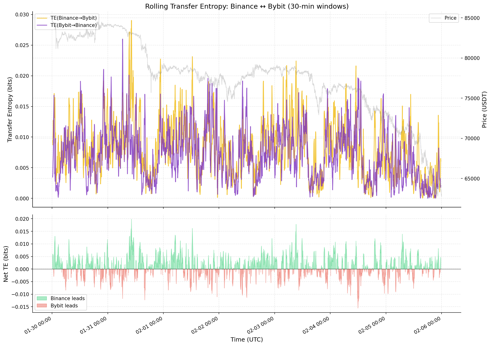
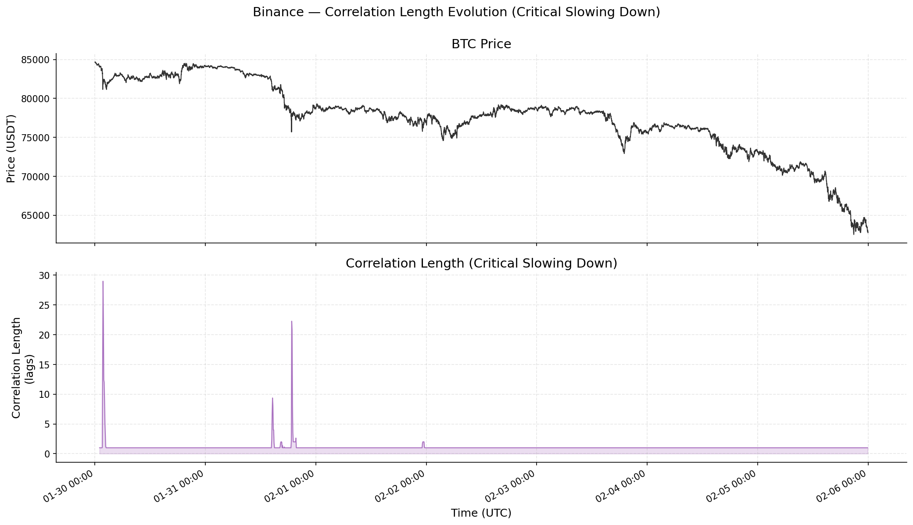
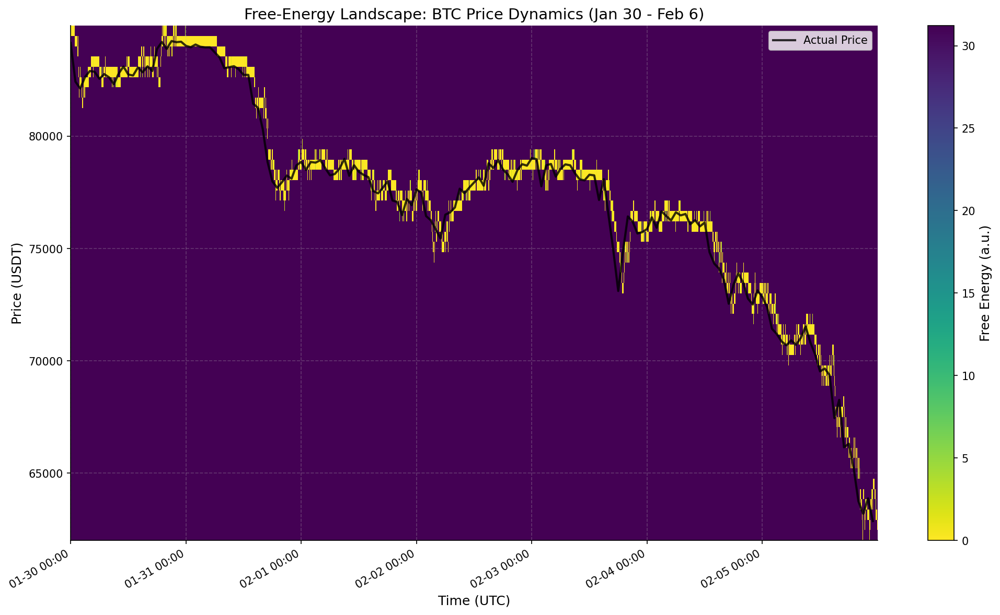
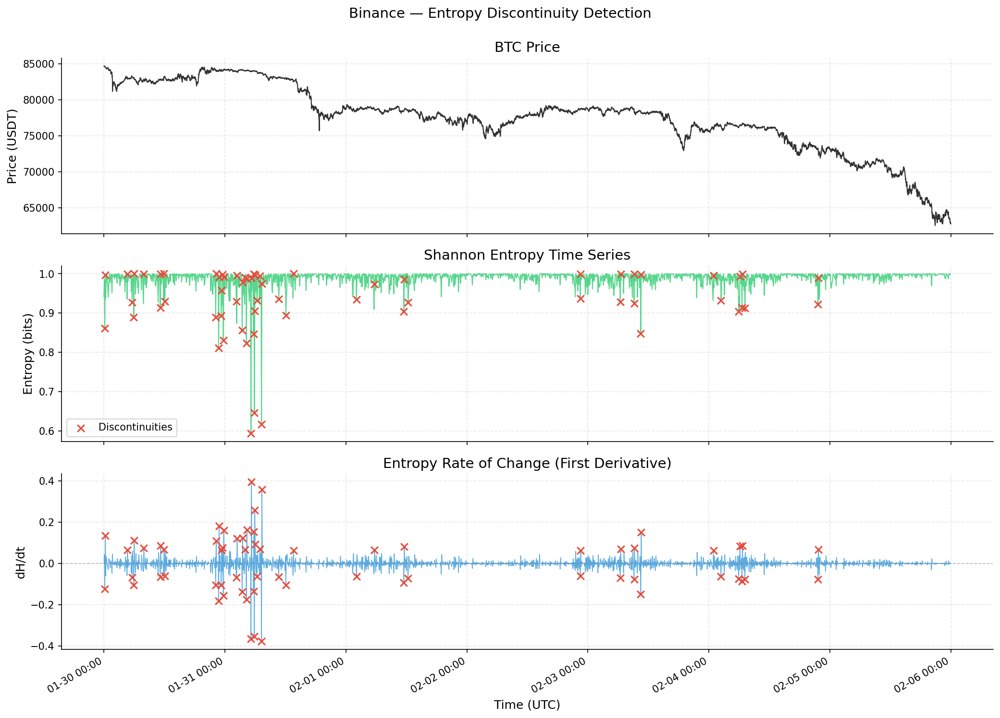
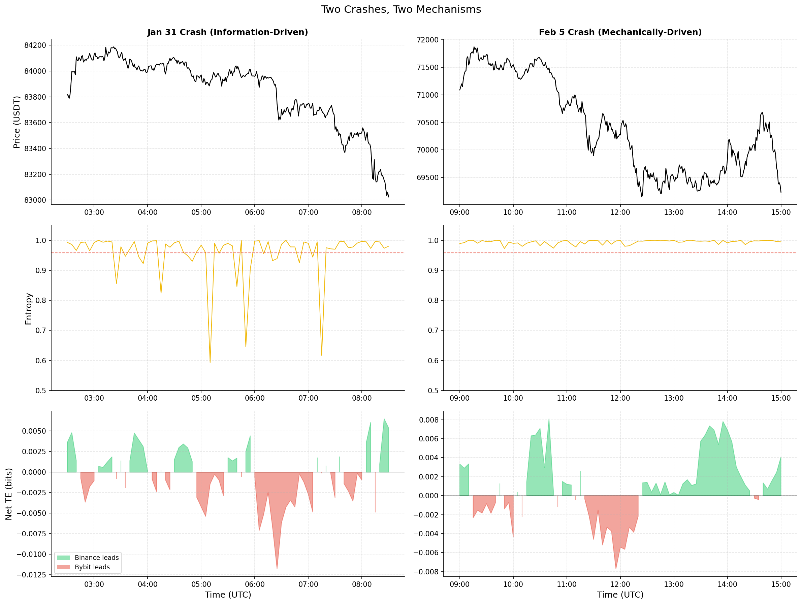

# Statistical Mechanics of Cross-Venue Information Flow in Bitcoin Perpetual Futures

## Abstract

This study applies statistical mechanics to quantify cross-venue information flow in Bitcoin perpetual futures during a major crash period (Jan 30 to Feb 6, 2026, $84K to $62K) across Binance and Bybit. Using Shannon entropy, transfer entropy, phase transition detection, and free-energy landscape construction, we identify three operationally distinct market states and demonstrate that two crashes within the same week exhibit fundamentally different microstructural signatures. The integrated autocorrelation time ($\tau_{\mathrm{int}}$) provides a genuine forward-looking signal ($\rho = 0.34$ with 30-minute forward volatility), Shannon entropy below the 5th percentile precedes significant price moves 88.1% of the time, and physics-based metastable levels overlap 90% with traditional support/resistance while adding quantitative strength measures. The central finding is that information-driven crashes (low entropy, clear venue leadership) and mechanically-driven crashes (normal entropy, liquidation cascades) require fundamentally different trading responses, and the statistical mechanics framework distinguishes them in real time.

## 1. Motivation

Cross-venue price discovery in crypto perpetual futures markets is poorly understood at the microstructure level. With BTC perpetual futures trading simultaneously on Binance, Bybit, OKX, and other venues, information does not originate uniformly: some venues lead, some follow, and the leadership hierarchy shifts dynamically. For a cross-venue HFT desk, three questions are critical: (1) where does informed trading originate, (2) when does the market undergo regime shifts, and (3) what are the quasi-stable price levels where the market lingers before transitioning?

Traditional approaches to these questions use linear correlation, simple volatility thresholds, and heuristic support/resistance (round numbers, swing points). This project tests whether statistical mechanics provides a more principled framework. We map market observables to thermodynamic quantities: trade sign entropy measures disorder, transfer entropy measures directional information flow, realised volatility serves as temperature, and the empirical price distribution defines a free-energy landscape with metastable states. The question is not whether markets are literally physical systems (they are not), but whether the mathematical tools of statistical mechanics extract useful structure that traditional methods miss.

## 2. Data and Methodology

### Data

We analyse 7 days of BTC-USDT perpetual futures trade data (Jan 30 to Feb 5, 2026) from two venues:

- **Binance:** 69.4 million trades, mean arrival rate 115 trades/s
- **Bybit:** 35.0 million trades, mean arrival rate 58 trades/s

This period includes two major crashes: a $6K drop on Jan 31 (from $84K to $78K) and a $13K drop on Feb 5-6 (from $75K to $62K), providing a natural experiment in regime transitions.

### Analytical Framework

The analysis proceeds in four stages, each building on the previous:

1. **Microstructure exploration** (Phase 2): Trade arrival rates, size distributions, autocorrelation structure, and the Epps effect (cross-venue correlation vs timescale).

2. **Entropy analysis** (Phase 3): Shannon entropy of trade signs in rolling 5-minute windows quantifies order flow disorder. Transfer entropy at 1-second resolution measures directional information flow between venues. Mutual information as a function of lag quantifies the information-sharing timescale.

3. **Phase transition detection** (Phase 4): Realised volatility (temperature), order flow imbalance (order parameter), and susceptibility define a thermodynamic state space. The integrated autocorrelation time ($\tau_{\mathrm{int}} = 0.5 + \sum_{k=1}^{k^*} \mathrm{ACF}(k)$, truncated at the first negative ACF) measures critical slowing down. Entropy discontinuity detection identifies first-order-like regime transitions.

4. **Metastability analysis** (Phase 5): The free-energy landscape $F(x) = -k_BT \ln P(x)$ is constructed from empirical price distributions in rolling 4-hour windows. Local minima identify metastable levels with quantitative well depths. Dwell time analysis measures how long the market lingers at each level, and Kramers escape theory is tested against the data.

## 3. Key Findings

### 3.1 Cross-Venue Information Flow

Transfer entropy resolves an information leadership hierarchy invisible to linear cross-correlation, which showed no detectable lead-lag at 1-second resolution (Phase 2). At history length $k=1$, TE(Binance $\to$ Bybit) = 0.00674 bits exceeds TE(Bybit $\to$ Binance) = 0.00641 bits, with Binance leading in 59.4% of rolling 30-minute windows. Transfer entropy is statistically significant (vs shuffled baseline) in 53.2% of Binance-led windows.

An important caveat: at $k=2$ and $k=3$, the leadership reverses to Bybit. This suggests Binance has faster "first-mover" influence (its most recent action predicts Bybit's next), while Bybit's influence operates through longer-range temporal patterns. The $k=1$ result is more relevant for low-latency execution; $k=2$-$3$ may be relevant for longer-horizon strategies.

Mutual information peaks at lag = 0 seconds (0.076 bits) and drops 86% within 1 second, confirming that the cross-venue information-sharing timescale is sub-second. Any informational edge from observing one venue's flow must be acted upon within 1-2 seconds.

### 3.2 Regime Detection and Phase Transitions

The integrated autocorrelation time provides the strongest forward-looking signal in the study: $\rho = 0.34$ with 30-minute forward volatility. When $\tau_{\mathrm{int}}$ exceeds its 90th percentile, subsequent volatility is 1.65$\times$ the baseline. This is a genuine early warning: the market's volatility structure becomes self-reinforcing before the regime shift fully materialises.

Entropy discontinuity detection reveals 63 first-order-like transitions, heavily concentrated around the Jan 31 crash but largely absent during the Feb 5-6 crash. This asymmetry is the key to the "two crashes, two mechanisms" finding (Section 3.4).

Regime classification using a 2-of-3 scoring system (temperature, entropy, correlation length) produces: Hot 12.0%, Cold 12.5%, Critical 19.6%, Transitional 55.9%. The high Transitional fraction reflects the stringency of requiring two simultaneous extreme-quartile indicators, and indicates that markets are far from the clean phase separation of equilibrium systems.

### 3.3 Metastable Price Levels

The free-energy landscape constructed from rolling 4-hour price distributions identifies 98 metastable levels across 162 windows, with well depths ranging from 0.8 (shallow, transient) to 7.5 (deep, persistent). These physics-based levels overlap 90% with traditional support/resistance (18 of 20 traditional levels matched within $\pm$1%).

The value-add over traditional S/R is threefold: (1) quantitative strength via well depth, distinguishing strong support (depth > 5.0) from weak (depth < 2.0); (2) temporal evolution, where monitoring depth degradation across successive windows provides early warning of level failure; and (3) 13 additional levels at non-round-number consolidation points invisible to traditional heuristics.

Dwell times at metastable levels follow an approximately exponential distribution (median 41 seconds, mean 134.5 seconds, $\lambda = 0.0074$), consistent with a memoryless escape process. Kramers escape theory predicts $\tau \sim \exp(\Delta F / k_BT)$; the empirical correlation between barrier height and log-dwell-time is weak ($\rho = 0.157$), consistent with an externally driven system where liquidation cascades override thermal escape dynamics.

### 3.4 Two Crashes, Two Mechanisms

The central narrative finding: the Jan 31 and Feb 5-6 crashes are structurally different, and the statistical mechanics framework distinguishes them cleanly.

**Jan 31 ($84K to $78K): Information-driven.** Shannon entropy collapses to $H = 0.59$ (well below the 5th percentile of 0.958). Transfer entropy spikes with clear Binance leadership. 63 entropy discontinuities concentrate in this period. $\tau_{\mathrm{int}}$ shows a sharp spike to $\sim$39 lags (critical-point-like). Deep metastable wells erode before the price breaks. This is a crash driven by informed directional trading, with information cascading from the leading venue.

**Feb 5-6 ($75K to $62K): Mechanically-driven.** Entropy stays near 1.0 despite a larger absolute price decline. Transfer entropy is elevated but bidirectional, with no clear leader. Entropy discontinuities are largely absent. $\tau_{\mathrm{int}}$ shows a broader, lower elevation ($\sim$21 lags). Metastable levels are shallow with rapid staircase breakdown. This is a crash driven by liquidation cascades and forced selling, where both sides of the order book are active.

## 4. Trading Implications

Every finding maps to a specific, quantitative trading action:

**Real-time monitoring.** Shannon entropy below the 5th percentile on Binance signals a directional burst; 88.1% of such signals preceded |return| > 0.05% within 5 minutes. This is a high-confidence trigger to reduce passive exposure.

**Venue selection.** Net transfer entropy identifies the information-leading venue in real time. When leadership reverses (net TE flips sign for 2+ consecutive windows), execution should shift to the new leader.

**Risk management.** $\tau_{\mathrm{int}}$ exceeding $2\times$ its trailing median signals regime instability ($\rho = 0.34$ with forward volatility). Reduce position sizes and widen execution bands.

**Crash-type identification.** Within 30 minutes, the entropy-TE signature identifies whether a crash is information-driven (low entropy, clear TE leadership; follow or fade the informed flow) or mechanically-driven (normal entropy, bidirectional TE; provide liquidity at deep metastable levels, as mean-reversion is more likely once the cascade exhausts).

**Order placement.** Metastable levels with well depth > 5.0 in stable regimes ($\tau_{\mathrm{int}}$ < median) are safe targets for passive limit orders. Median dwell time of 41 seconds defines the stale-order timeout. When well depth degrades below 2.0, pull resting bids.

**Complementary signals.** Rather than converging on the same events, entropy and metastability signals provide complementary coverage of different crash types. Low entropy preceded 17.8% of major price moves (information-driven); weak well depth preceded 9.9% (structural breakdown). Together, 27.5% of major moves were preceded by at least one signal within 30 minutes, with almost no overlap, confirming the two-crash-type finding.

## 5. Limitations and Future Work

### Limitations

The results are conditioned on a single 7-day crash period and may not generalise to ranging or bullish markets. The equilibrium statistical mechanics framework provides useful conceptual vocabulary, but quantitative predictions transfer only partially: Kramers escape theory showed weak correlation ($\rho = 0.157$) in aggregate and failed conditionally ($\rho \approx -0.08$ in both stable and unstable regimes), confirming that financial markets are externally driven non-equilibrium systems where barrier-dominated escape does not apply. Transfer entropy leadership is sensitive to history length ($k$), with the direction reversing at $k=2$-$3$. The regime classifier is ambiguous 55.9% of the time (Transitional), and regime transitions do not predict higher forward volatility ($0.92\times$).

### Future Directions

With additional time and data, the most promising extensions are: (1) sub-second data to resolve the information propagation timescale below our 1-second floor; (2) cross-venue metastability to test whether Binance levels predict Bybit S/R with a lag; (3) non-equilibrium escape models (hazard rates conditioned on market state) to replace the failed Kramers framework; (4) a live implementation of the five-panel market state dashboard on streaming data; and (5) formal backtesting of a combined entropy-metastability strategy across multiple market regimes.

## References

- Schreiber, T. (2000). Measuring information transfer. *Physical Review Letters*, 85(2), 461.
- Epps, T. W. (1979). Comovements in stock prices in the very short run. *Journal of the American Statistical Association*, 74(366), 291-298.
- Shannon, C. E. (1948). A mathematical theory of communication. *Bell System Technical Journal*, 27(3), 379-423.
- Kramers, H. A. (1940). Brownian motion in a field of force and the diffusion model of chemical reactions. *Physica*, 7(4), 284-304.
- Sokal, A. D. (1997). Monte Carlo methods in statistical mechanics: Foundations and new algorithms. *Functional Integration*, 131-192.
